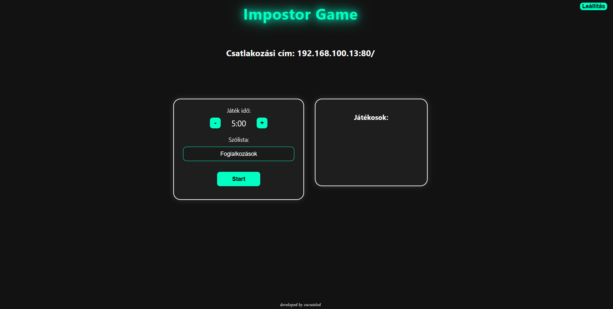

# ImpostorGame
This is a practical implementation of a popular locally hosted multiplayer impostor game using the web.

Currently only Hungarian leanguage supported.
Maven Builded file in /target.
You can run the Snapshot.

It was built for fun.

Java SDK 23.0.1 or above
Download the SNAPSHOT and run.

'static/words' folder contains all words (in .txt). You can translate them to any leanguage or add more.
